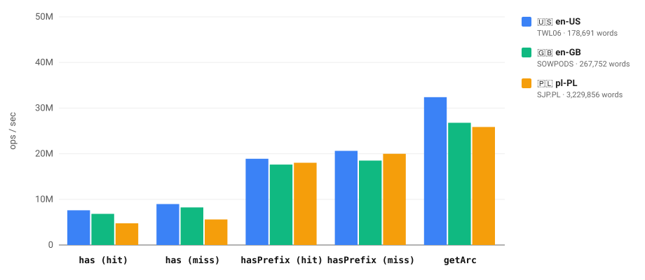
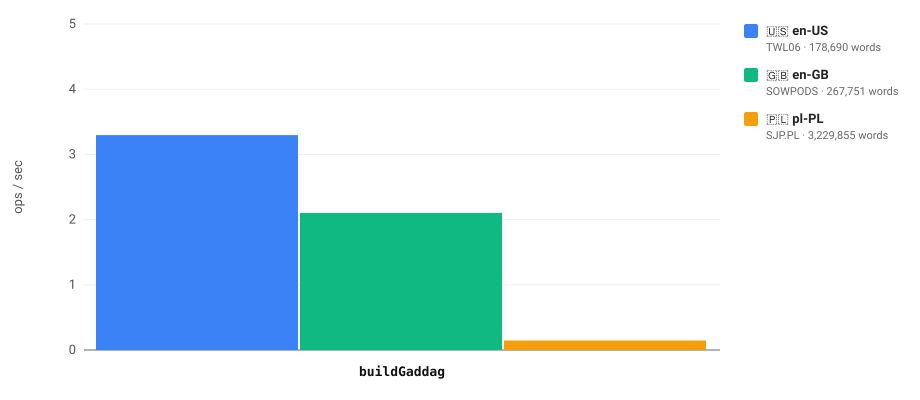
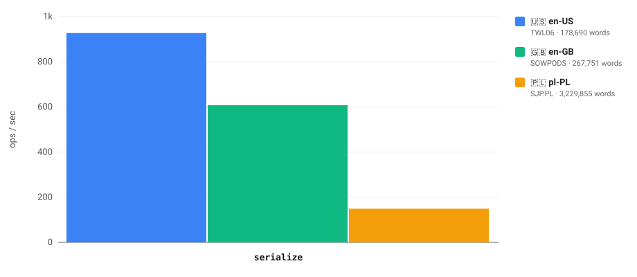
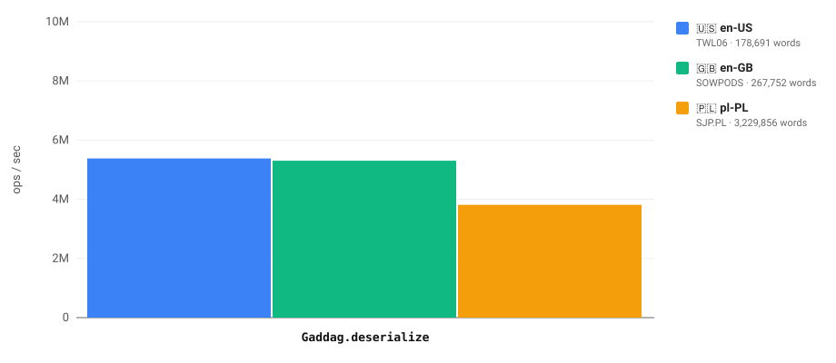

<div align="center">
<h1>@kamilmielnik/gaddag</h1>


</div>

----

> [!WARNING]
> This project has been 100% LLM-generated. Use it at your own risk.

----

[GADDAG](https://en.wikipedia.org/wiki/GADDAG) ([Gordon, 1994](https://ericsink.com/downloads/faster-scrabble-gordon.pdf)) data structure implemented in TypeScript:

- [Highly performant](#performance)
- No dependencies
- Backed by flat typed arrays — compact in memory, [near-instant to deserialize](#performance)
- Built for [Scrabble Solver](https://github.com/kamilmielnik/scrabble-solver)
- CJS & ESM compatible

A GADDAG is a minimized automaton that, for every word `w` and every split point `s` (`1 ≤ s ≤ |w|`), accepts `reverse(w[0..s)) + ◇ + w[s..)` (the separator `◇` is omitted when `s = |w|`). This lets a move generator extend words in **both directions** from any anchor cell, which is what makes GADDAG-based Scrabble engines an order of magnitude faster than naive dictionary scans.

# Table of contents

- [Installation](#installation)
- [API](#api)
- [Limits](#limits)
- [Examples](#examples)
  - [Build a GADDAG from a word list](#build-a-gaddag-from-a-word-list)
  - [Serialize a GADDAG to a file](#serialize-a-gaddag-to-a-file)
  - [Load a serialized GADDAG from a file](#load-a-serialized-gaddag-from-a-file)
  - [Traverse arcs directly](#traverse-arcs-directly)
- [Serialization and size](#serialization-and-size)
- [Performance](#performance)

# Installation

```Shell
# Bun
bun add @kamilmielnik/gaddag

# npm
npm install @kamilmielnik/gaddag

# Yarn
yarn add @kamilmielnik/gaddag
```

# [API](docs/README.md)

See full [API Docs](docs/README.md) - generated by [typedoc](http://typedoc.org/).

| Export | Description |
| --- | --- |
| `buildGaddag(words: string[]): Gaddag` | Builds a minimal GADDAG from a word list (any order, duplicates allowed). |
| `Gaddag#has(word: string): boolean` | Tells you whether the word is in the dictionary. |
| `Gaddag#hasPrefix(prefix: string): boolean` | Tells you whether any word starts with the prefix. |
| `Gaddag#getArc(ref: number, letter: number): number` | Follows an arc; returns the target state ref, or `0` when absent. |
| `Gaddag#getLetter(charCode: number): number` | Maps a code point to its letter index (`-1` when outside the alphabet). |
| `Gaddag#rootRef` | Ref of the root state — the entry point for `getArc` traversals. |
| `Gaddag#serialize(): Uint8Array` | Serializes the automaton to a compact binary format. |
| `Gaddag.deserialize(bytes: Uint8Array): Gaddag` | The inverse of `serialize` — zero-copy when the input is 4-byte aligned. |
| `SEPARATOR` | Letter index of the `◇` separator (`0`). |
| `LAST_ARC_FLAG`, `LETTER_MASK` | Bit layout of arc labels, for direct `arcLabels`/`arcTargets` traversal. |
| `MAX_LETTERS`, `MAX_WORD_LENGTH`, `MAX_WORDS` | See [Limits](#limits). |

State refs encode `(firstArcIndex << 1) | isWordEnd` — after following the last letter of a word, check `ref & 1` to know whether the path spells a complete word.

# Limits

| Limit | Value | Behavior when exceeded |
| --- | --- | --- |
| Distinct characters (`MAX_LETTERS`) | 63 | `buildGaddag` throws — a letter index takes 6 bits, and `0` is reserved for the `◇` separator. |
| Word length (`MAX_WORD_LENGTH`) | 63 characters | The word is skipped — no board fits it anyway, and a split position takes 6 bits. |
| Word list length (`MAX_WORDS`) | 33,554,431 (`2^25 - 1`) | `buildGaddag` throws — a word index and a split position pack into one 31-bit integer. |

Empty words are skipped. Duplicated words and unsorted input are fine — the same minimal automaton is produced regardless of word order.

# Examples

## Build a GADDAG from a word list

```TypeScript
import { buildGaddag } from '@kamilmielnik/gaddag';

const gaddag = buildGaddag(['scrabble', 'solver']);

gaddag.has('solver'); // true
gaddag.has('solve'); // false
gaddag.hasPrefix('scra'); // true
```

## Serialize a GADDAG to a file

```TypeScript
import { writeFile } from 'node:fs/promises';
import { buildGaddag } from '@kamilmielnik/gaddag';

const gaddag = buildGaddag(['scrabble', 'solver']);
await writeFile('dictionary.gaddag', gaddag.serialize());
```

## Load a serialized GADDAG from a file

```TypeScript
import { readFile } from 'node:fs/promises';
import { Gaddag } from '@kamilmielnik/gaddag';

const buffer = await readFile('dictionary.gaddag');
const gaddag = Gaddag.deserialize(new Uint8Array(buffer.buffer, buffer.byteOffset, buffer.byteLength));
```

## Traverse arcs directly

This is how a Scrabble move generator consumes the automaton — e.g. verifying that `"cat"` can be formed around an anchor on the letter `a`:

```TypeScript
import { buildGaddag, SEPARATOR } from '@kamilmielnik/gaddag';

const gaddag = buildGaddag(['cat']);
const a = gaddag.getLetter('a'.charCodeAt(0));
const c = gaddag.getLetter('c'.charCodeAt(0));
const t = gaddag.getLetter('t'.charCodeAt(0));

// Read "ca" leftwards from the anchor (reversed), cross the separator, read "t" rightwards.
let ref = gaddag.rootRef;
ref = gaddag.getArc(ref, a);
ref = gaddag.getArc(ref, c);
ref = gaddag.getArc(ref, SEPARATOR);
ref = gaddag.getArc(ref, t);

const isWord = (ref & 1) === 1; // true
```

# Serialization and size

<!-- SIZE:summary:start -->
A GADDAG trades space for lookup speed: for SJP.PL (pl-PL) the serialized automaton is 43.69% smaller than the raw word list, and it compresses well — with [7-Zip](https://en.wikipedia.org/wiki/7z) at ultra compression level it takes just 20.64% of the raw word list size.
<!-- SIZE:summary:end -->

<!-- SIZE:start -->
| Language | 🇺🇸 en-US | 🇬🇧 en-GB | 🇵🇱 pl-PL |
| --- | --- | --- | --- |
| Name | [TWL06](https://en.wikipedia.org/wiki/NASPA_Word_List) | [SOWPODS](https://en.wikipedia.org/wiki/Collins_Scrabble_Words) | [SJP.PL](https://sjp.pl/slownik/dp.phtml) |
| Source | [Download](https://raw.githubusercontent.com/kamilmielnik/scrabble-dictionaries/master/english/twl06.txt) | [Download](https://raw.githubusercontent.com/kamilmielnik/scrabble-dictionaries/master/english/sowpods.txt) | [Download](https://raw.githubusercontent.com/kamilmielnik/scrabble-dictionaries/master/polish/sjp.txt) |
| Words count | 178,690 | 267,751 | 3,229,855 |
| Arcs count | 830,451 | 1,203,338 | 4,749,518 |
| Word list size [B] | 1,763,166 | 2,707,020 | 42,172,320 |
| Serialized GADDAG size [B] | (+135.51%) 4,152,375 | (+122.27%) 6,016,810 | (-43.69%) 23,747,746 |
| Word list size ([7z](https://en.wikipedia.org/wiki/7z)) [B] | (-78.54%) 378,418 | (-79.23%) 562,247 | (-86.84%) 5,550,546 |
| Serialized GADDAG size ([7z](https://en.wikipedia.org/wiki/7z)) [B] | (+0.88%) 1,778,664 | (-4.16%) 2,594,366 | (-79.36%) 8,705,878 |
<!-- SIZE:end -->

# Performance

Benchmarks are produced by [`bench/index.ts`](bench/index.ts) using [tinybench](https://github.com/tinylibs/tinybench). Run `bun run bench` to regenerate the charts below.

<!-- BENCH:fast:start -->

<!-- BENCH:fast:end -->

`buildGaddag`, `serialize`, and `deserialize` each run at a different order of magnitude (deserialization only wraps typed-array views over the input bytes), so each gets its own chart:

<!-- BENCH:buildGaddag:start -->

<!-- BENCH:buildGaddag:end -->

<!-- BENCH:serialize:start -->

<!-- BENCH:serialize:end -->

<!-- BENCH:deserialize:start -->

<!-- BENCH:deserialize:end -->
